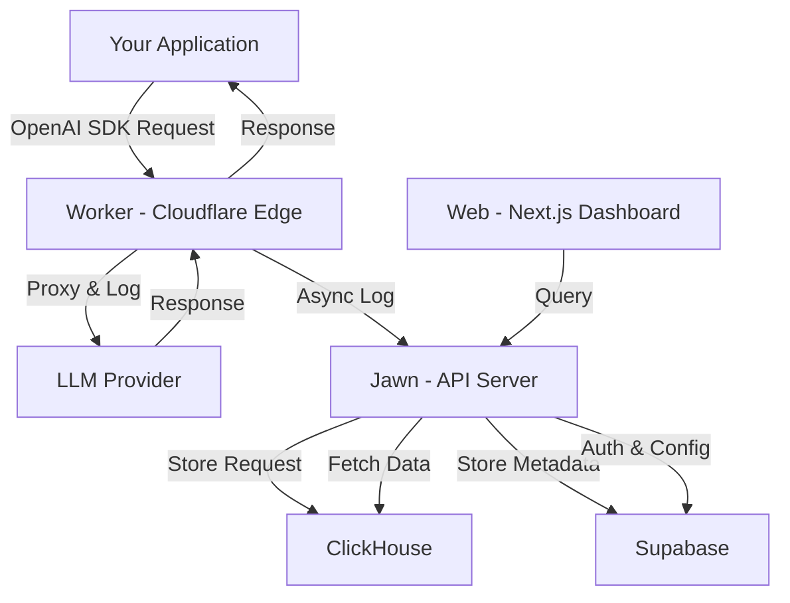

Helicone is designed as a distributed system optimized for low-latency request logging and high-throughput analytics. This guide explains how requests flow through our platform and how the components work together.

## Architecture Overview

Helicone consists of five main components working together to provide seamless LLM observability:

<Frame>
  
</Frame>



## Core Components

### 1. Worker (Cloudflare Workers)

**Location:** `worker/`  
**Technology:** TypeScript on Cloudflare's global edge network  
**Purpose:** Request proxy and logging

<Card icon="bolt">
  The Worker is the entry point for all LLM requests. It intercepts requests, forwards them to the appropriate provider, and logs metadata with minimal latency overhead (less than 50ms).
</Card>

**Key Responsibilities:**
- Proxy requests to LLM providers (OpenAI, Anthropic, Google, etc.)
- Extract request/response metadata (tokens, latency, cost)
- Implement caching, rate limiting, and fallback logic
- Stream responses back to clients without buffering
- Asynchronously send logs to Jawn

**Performance Characteristics:**
- Deployed to 300+ global edge locations
- Less than 50ms latency overhead on average
- Handles 10,000+ requests/second per deployment
- Automatic scaling with no cold starts

**Example Worker Flow:**
```typescript
// Simplified worker logic
export default {
  async fetch(request: Request): Promise<Response> {
    // 1. Parse incoming request
    const { provider, model } = parseRequest(request);
    
    // 2. Check cache (optional)
    const cached = await checkCache(request);
    if (cached) return cached;
    
    // 3. Proxy to provider
    const startTime = Date.now();
    const response = await proxyToProvider(provider, request);
    const endTime = Date.now();
    
    // 4. Extract metadata and log asynchronously
    logToJawn({
      request,
      response,
      latency: endTime - startTime,
      cost: calculateCost(model, tokens),
    });
    
    // 5. Return response immediately
    return response;
  }
}
```

### 2. Jawn (API Server)

**Location:** `valhalla/jawn/`  
**Technology:** Express + TypeScript with Tsoa for type-safe APIs  
**Purpose:** Centralized API server for log collection and queries

<Card icon="server">
  Jawn (named after the Philadelphia slang for "thing") is the heart of Helicone's backend. It collects logs from Workers, serves the Web dashboard, and provides the REST API.
</Card>

**Key Responsibilities:**
- Receive logs from Workers and insert into ClickHouse
- Serve REST API for dashboard queries
- Handle webhooks, exports, and integrations
- Manage prompt versioning and deployment
- Process batch operations and analytics queries
- Implement authentication and authorization

**API Endpoints (examples):**
- `POST /v1/request/query` - Query requests with filters
- `POST /v1/session/query` - Retrieve session traces
- `POST /v1/prompt-2025` - Create/update prompts
- `GET /v1/request/{id}` - Fetch individual request details

**Built with:**
- Express.js for HTTP routing
- Tsoa for OpenAPI spec generation
- Auto-generated TypeScript types for type safety

<Tip>
  Jawn's API is fully documented with OpenAPI specs. Explore the [REST API reference](/api/requests/query).
</Tip>

### 3. Web (Next.js Dashboard)

**Location:** `web/`  
**Technology:** Next.js 14 (App Router) + React + TailwindCSS  
**Purpose:** User-facing dashboard and UI

<Card icon="display">
  The Web component provides the visual interface for exploring requests, debugging sessions, managing prompts, and analyzing costs.
</Card>

**Key Features:**
- Request explorer with advanced filtering
- Session tree visualization for multi-step workflows
- Cost and usage dashboards with charts
- Prompt management UI with versioning
- Playground for testing prompts
- User settings and API key management

**Built with:**
- Next.js 14 (App Router) for SSR and routing
- React for components
- TailwindCSS for styling
- Tremor for charts and analytics
- Recharts for custom visualizations

### 4. Supabase (Application Database)

**Location:** `supabase/`  
**Technology:** PostgreSQL + Supabase Auth  
**Purpose:** User authentication and application state

<Card icon="database">
  Supabase stores user accounts, API keys, organization settings, prompt metadata, and configuration. It does NOT store request/response bodies—those go to ClickHouse.
</Card>

**Schema Highlights:**
- `auth.users` - User accounts and authentication
- `organization` - Multi-tenant org structure
- `prompt_v2` - Prompt definitions and versions
- `api_keys` - API key management
- `webhooks` - Webhook configurations
- `rate_limits` - Custom rate limit rules

**Why Supabase?**
- Built-in authentication with JWTs
- Real-time subscriptions for live updates
- Row-level security (RLS) for multi-tenancy
- Easy local development with Docker

### 5. ClickHouse (Analytics Database)

**Location:** `clickhouse/`  
**Technology:** ClickHouse (columnar OLAP database)  
**Purpose:** High-performance storage for request logs and analytics

<Card icon="chart-column">
  ClickHouse is a columnar database optimized for analytical queries. It enables Helicone to query millions of requests in milliseconds.
</Card>

**Why ClickHouse?**
- 100-1000x faster than PostgreSQL for analytics queries
- Handles billions of rows without performance degradation
- Efficient compression (10:1 ratio on average)
- Columnar storage perfect for aggregations

**Main Tables:**
- `request_response_versioned` - All LLM requests and responses
- `request_response_log` - Immutable append-only log
- `properties_v2` - Custom properties (user IDs, tags, etc.)
- `cache_hits` - Cache performance metrics

**Query Performance:**
- Full-text search across millions of requests: less than 100ms
- Cost aggregations by user: less than 200ms
- Session tree reconstruction: less than 50ms

<Tip>
  ClickHouse's columnar design means filtering on `user_id` or `model` is extremely fast, even with billions of rows.
</Tip>

## Request Flow Walkthrough

Let's trace a single LLM request through the entire Helicone system:

<Steps>
  <Step title="Client sends request">
    Your application sends a request to `https://ai-gateway.helicone.ai` using the OpenAI SDK.
    
    ```typescript
    const response = await client.chat.completions.create({
      model: "gpt-4o-mini",
      messages: [{ role: "user", content: "Hello!" }],
    });
    ```
  </Step>

  <Step title="Worker intercepts request">
    The request hits Cloudflare's global edge network and routes to the nearest Worker.
    
    The Worker:
    - Authenticates the API key
    - Checks for cached responses (if caching enabled)
    - Determines the target provider (OpenAI, Anthropic, etc.)
  </Step>

  <Step title="Worker proxies to provider">
    The Worker forwards the request to the LLM provider's API (e.g., `api.openai.com`).
    
    For streaming requests, the Worker streams chunks back to the client in real-time without buffering.
  </Step>

  <Step title="Provider responds">
    The LLM provider (OpenAI, Anthropic, etc.) sends the response back through the Worker.
    
    The Worker:
    - Calculates latency (total time, time to first token)
    - Counts tokens (from response headers or body)
    - Calculates cost using Helicone's pricing database
  </Step>

  <Step title="Worker logs to Jawn (async)">
    The Worker asynchronously sends the log payload to Jawn via HTTP POST:
    
    ```json
    {
      "request": { "model": "gpt-4o-mini", "messages": [...] },
      "response": { "choices": [...] },
      "latency": 1234,
      "tokens": { "prompt": 10, "completion": 25 },
      "cost": 0.00015,
      "provider": "openai"
    }
    ```
    
    This happens **after** the response is sent to the client, adding zero latency.
  </Step>

  <Step title="Jawn writes to ClickHouse">
    Jawn receives the log and inserts it into ClickHouse's `request_response_versioned` table.
    
    Custom properties (user ID, environment, etc.) are stored in the `properties_v2` table.
  </Step>

  <Step title="Dashboard queries Jawn">
    When you open the Web dashboard, it queries Jawn's REST API:
    
    ```
    POST /v1/request/query
    {
      "filter": { "model": "gpt-4o-mini" },
      "limit": 50
    }
    ```
    
    Jawn queries ClickHouse and returns results in less than 100ms, even with millions of rows.
  </Step>

  <Step title="Real-time updates">
    The dashboard uses polling or WebSockets to show new requests in real-time as they're logged.
  </Step>
</Steps>

## Deployment Options

Helicone offers three deployment models:

### 1. Helicone Cloud (Managed)

<Card icon="cloud">
  **Best for:** Most teams who want zero infrastructure management
  
  - Fully managed by Helicone
  - SOC 2 compliant
  - 99.9% uptime SLA
  - US and EU regions available
  - Automatic updates and scaling
  
  **Sign up:** [helicone.ai/signup](https://helicone.ai/signup)
</Card>

### 2. Self-Hosted (Docker)

<Card icon="docker">
  **Best for:** Teams with compliance requirements or who want full control
  
  Deploy Helicone in your own infrastructure using Docker Compose:
  
  ```bash
  git clone https://github.com/Helicone/helicone.git
  cd helicone/docker
  cp .env.example .env
  ./helicone-compose.sh helicone up
  ```
  
  **Includes:**
  - All five components (Web, Worker, Jawn, Supabase, ClickHouse)
  - MinIO for object storage
  - Pre-configured with sane defaults
  
  [View self-hosting guide →](/self-hosting/docker)
</Card>

### 3. Enterprise (Helm Chart)

<Card icon="kubernetes">
  **Best for:** Large enterprises with Kubernetes clusters
  
  Production-ready Helm chart for Kubernetes deployments:
  
  - High availability with automatic failover
  - Horizontal scaling for all components
  - Observability with Prometheus/Grafana
  - Backup and disaster recovery
  
  Contact [enterprise@helicone.ai](mailto:enterprise@helicone.ai) for access.
</Card>

## Performance Characteristics

<CardGroup cols={2}>
  <Card icon="gauge">
    **Latency Overhead**
    
    - P50: less than 30ms
    - P95: less than 50ms
    - P99: less than 100ms
    
    Edge deployment keeps latency invisible.
  </Card>
  
  <Card icon="arrow-trend-up">
    **Throughput**
    
    - 10,000+ requests/second per region
    - Auto-scales to millions of requests/day
    - No rate limits on logging
  </Card>
  
  <Card icon="database">
    **Storage**
    
    - Unlimited request storage
    - 10:1 compression ratio
    - Cost: ~$0.01 per 1,000 requests
  </Card>
  
  <Card icon="magnifying-glass">
    **Query Speed**
    
    - Full-text search: less than 100ms
    - Aggregations: less than 200ms
    - Session reconstruction: less than 50ms
  </Card>
</CardGroup>

## Data Flow & Security

### What Gets Stored Where?

| Data Type | Storage Location | Retention |
|-----------|-----------------|----------|
| Request/response bodies | ClickHouse | Unlimited (configurable) |
| User accounts & auth | Supabase (PostgreSQL) | Permanent |
| API keys | Supabase (encrypted) | Permanent |
| Prompt templates | Supabase | Permanent with versioning |
| Analytics aggregates | ClickHouse | Unlimited |
| Custom properties | ClickHouse | Unlimited |

### Security Measures

<AccordionGroup>
  <Accordion title="Encryption" icon="lock">
    - **In transit:** All traffic uses TLS 1.3
    - **At rest:** AES-256 encryption for stored data
    - **API keys:** Hashed with bcrypt before storage
    - **Secrets:** Managed via secure environment variables
  </Accordion>

  <Accordion title="Compliance" icon="shield-check">
    - **SOC 2 Type II** certified
    - **GDPR** compliant with EU region option
    - **CCPA** compliant
    - **Data residency:** US and EU regions available
  </Accordion>

  <Accordion title="Data Privacy" icon="eye-slash">
    - **Omit logs:** Disable request/response body storage
    - **PII redaction:** Automatically detect and redact sensitive data
    - **Self-hosting:** Full control over your data
  </Accordion>
</AccordionGroup>

<Card title="Learn More About Security" icon="shield" href="/references/data-autonomy">
  Read our data autonomy and security documentation
</Card>

## Monitoring & Observability

Helicone itself is instrumented for observability:

- **Metrics:** Prometheus metrics for all components
- **Logs:** Structured logging with correlation IDs
- **Tracing:** Distributed tracing across Worker → Jawn → ClickHouse
- **Alerts:** PagerDuty integration for incidents

<Tip>
  Self-hosted deployments include Grafana dashboards for monitoring Helicone's internal metrics.
</Tip>

## Scaling Considerations

<Steps>
  <Step title="Worker scaling (automatic)">
    Cloudflare Workers auto-scale globally with no configuration needed. You can handle sudden traffic spikes without manual intervention.
  </Step>

  <Step title="Jawn scaling (horizontal)">
    Deploy multiple Jawn instances behind a load balancer. Jawn is stateless and scales horizontally.
  </Step>

  <Step title="ClickHouse scaling (vertical + sharding)">
    - **Vertical:** Increase CPU/RAM for single-node deployments
    - **Horizontal:** Use ClickHouse clusters with sharding for billions of rows
  </Step>

  <Step title="Supabase scaling (managed)">
    Supabase handles PostgreSQL scaling automatically. For self-hosted, use read replicas for high traffic.
  </Step>
</Steps>

## Development & Testing

### Local Development Setup

```bash
# Clone the repository
git clone https://github.com/Helicone/helicone.git
cd helicone

# Install dependencies
yarn install

# Start local services (Supabase, ClickHouse, MinIO)
cd docker
./helicone-compose.sh helicone up

# Start Web dashboard
yarn workspace helicone dev:local

# Start Worker (in another terminal)
yarn workspace helicone-worker dev

# Start Jawn API server (in another terminal)
yarn workspace helicone-api dev
```

<Note>
  See the [AGENTS.md](https://github.com/Helicone/helicone/blob/main/AGENTS.md) file for detailed development guidelines.
</Note>

### Testing

- **Worker:** Vitest for unit tests
- **Jawn:** Jest for API tests
- **Web:** Jest + React Testing Library
- **Integration:** Python integration tests in `tests/`

```bash
# Run worker tests
yarn workspace helicone-worker test

# Run Jawn tests
yarn workspace helicone-api test

# Run integration tests
python tests/python_integration_tests.py
```

## Technical Decisions & Trade-offs

<AccordionGroup>
  <Accordion title="Why Cloudflare Workers?">
    **Pros:**
    - Global edge deployment (300+ locations)
    - Sub-50ms cold starts
    - Auto-scaling without configuration
    - Generous free tier
    
    **Trade-offs:**
    - Stateless (no local disk)
    - CPU time limits (requires efficient code)
  </Accordion>

  <Accordion title="Why ClickHouse over PostgreSQL?">
    **Pros:**
    - 100-1000x faster for analytical queries
    - Columnar storage ideal for aggregations
    - Built-in time-series capabilities
    
    **Trade-offs:**
    - Eventually consistent (not ACID)
    - Less flexible schema changes
    - Requires separate database from Supabase
  </Accordion>

  <Accordion title="Why Supabase for auth?">
    **Pros:**
    - Built-in JWT authentication
    - Row-level security for multi-tenancy
    - Real-time subscriptions
    - Easy local development
    
    **Trade-offs:**
    - Additional database dependency
    - Tied to PostgreSQL ecosystem
  </Accordion>
</AccordionGroup>

## Next Steps

Now that you understand Helicone's architecture:

<CardGroup cols={2}>
  <Card title="Self-Host Helicone" icon="server" href="/getting-started/self-deploy-docker">
    Deploy Helicone in your own infrastructure with Docker
  </Card>
  <Card title="Explore Features" icon="compass" href="/features/sessions">
    Learn about sessions, prompts, and advanced features
  </Card>
  <Card title="API Reference" icon="code" href="/rest/request/post-v1requestquery">
    Integrate directly with Helicone's REST API
  </Card>
  <Card title="Contributing Guide" icon="github" href="https://github.com/Helicone/helicone/blob/main/CONTRIBUTING_GUIDELINES.md">
    Contribute to the open-source project
  </Card>
</CardGroup>

## Questions?

For architecture-specific questions:
- Join [Discord](https://discord.com/invite/HwUbV3Q8qz) and ask in `#architecture`
- Open a [GitHub discussion](https://github.com/Helicone/helicone/discussions)
- Email [engineering@helicone.ai](mailto:engineering@helicone.ai)
