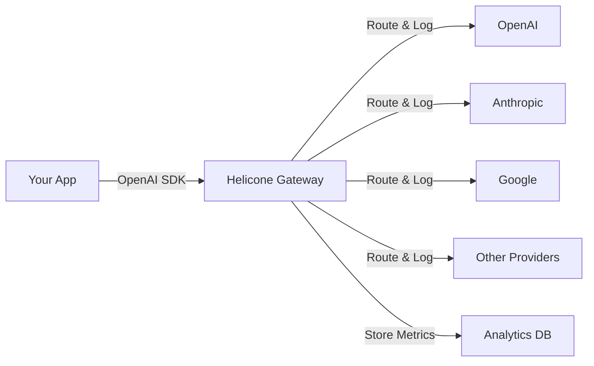

## What is Helicone?

Helicone is an open-source platform that combines **LLM observability** with an **AI Gateway** to help developers build reliable, cost-effective AI applications. We solve the core challenges of production LLM development: provider outages, unpredictable costs, and complex debugging.

<CardGroup cols={2}>
  <Card title="AI Gateway" icon="route" href="/gateway/overview">
    Access 100+ LLM models through one unified OpenAI-compatible API with automatic fallbacks and 0% markup
  </Card>
  <Card title="Full Observability" icon="chart-line" href="/features/sessions">
    Monitor every request with detailed traces, costs, latency, and errors across your entire LLM stack
  </Card>
  <Card title="Prompt Management" icon="wand-magic-sparkles" href="/gateway/prompt-integration">
    Version, test, and deploy prompts without code changes using production data
  </Card>
  <Card title="Enterprise Ready" icon="shield-check" href="/faq/compliance">
    SOC 2 compliant, GDPR ready, with self-hosting options for complete data control
  </Card>
</CardGroup>

## Key Features

Helicone provides everything you need to build production-grade LLM applications:

### Unified AI Gateway

<Card icon="network-wired">
  Access 100+ models from OpenAI, Anthropic, Google Gemini, AWS Bedrock, Groq, and more through a single OpenAI-compatible API. Switch providers by changing the model name—no code refactoring needed.
</Card>

**Supported Providers:**
- OpenAI (GPT-4o, GPT-4o-mini, o1, o3)
- Anthropic (Claude 4.5 Sonnet, Claude Opus, Claude Haiku)
- Google (Gemini 2.0 Flash, Gemini Pro)
- AWS Bedrock, Azure OpenAI, Groq, Together AI, Anyscale, and 20+ more

### Intelligent Routing & Reliability

<CardGroup cols={2}>
  <Card icon="arrows-turn-right">
    **Automatic Fallbacks**
    
    Configure fallback chains to route to backup providers when failures occur. Keep your app online during outages.
  </Card>
  <Card icon="gauge-high">
    **Rate Limit Management**
    
    Custom rate limits per user, endpoint, or any dimension to prevent abuse and control costs.
  </Card>
  <Card icon="bolt">
    **Response Caching**
    
    Cache identical requests to reduce latency and costs by up to 99% with semantic or exact matching.
  </Card>
  <Card icon="shield-halved">
    **LLM Security**
    
    Built-in prompt injection detection, PII redaction, and content moderation.
  </Card>
</CardGroup>

### Complete Observability

<Tip>
  Every request through Helicone is automatically logged with full context—no additional instrumentation required.
</Tip>

**What you get out of the box:**
- Request/response body inspection
- Cost tracking across all providers with our [300+ model pricing database](https://www.helicone.ai/llm-cost)
- Latency metrics (total time, time to first token, tokens per second)
- Error tracking and debugging
- Custom properties for filtering by user, feature, environment, etc.
- Session tracing for multi-step AI workflows
- Token usage analytics

### Advanced Debugging Tools

<Card icon="magnifying-glass-chart">
  **Session Trees**: Visualize complex AI agent workflows across multiple LLM calls. Trace the exact path of execution to find where things break.
  
  **Request Search**: Find any request in milliseconds with powerful filters across 10+ dimensions including cost, latency, model, user, and custom properties.
  
  **Playground**: Test prompts, replay requests, and compare model outputs side-by-side directly in the UI.
</Card>

### Prompt Management

Deploy prompt changes instantly without code deployments:

- Version control for prompts with full history
- A/B testing and experimentation
- Environment-based deployments (dev, staging, prod)
- Template variables and dynamic prompt compilation
- Rollback to any previous version instantly

## How It Works

Helicone operates as a transparent proxy between your application and LLM providers:



**Two integration options:**

1. **AI Gateway with Credits** (Recommended): Add credits to Helicone and access 100+ models instantly. We manage provider API keys for you at 0% markup.

2. **Bring Your Own Keys**: Connect your own provider API keys for observability-only mode with direct billing.

## Architecture

Helicone is built on five main components:

<Steps>
  <Step title="Web (Next.js)">
    Frontend dashboard for visualizing metrics, debugging requests, and managing prompts
  </Step>
  <Step title="Worker (Cloudflare)">
    Edge-deployed proxy that logs requests with less than 50ms latency overhead
  </Step>
  <Step title="Jawn (Express)">
    API server for collecting logs, serving queries, and managing platform features
  </Step>
  <Step title="Supabase">
    Authentication and application database for user data and configuration
  </Step>
  <Step title="ClickHouse">
    High-performance analytics database for querying millions of requests in milliseconds
  </Step>
</Steps>

## Integration Time: 2 Minutes

Get started in three lines of code:

<CodeGroup>
```typescript TypeScript
import { OpenAI } from "openai";

const client = new OpenAI({
  baseURL: "https://ai-gateway.helicone.ai",
  apiKey: process.env.HELICONE_API_KEY,
});

const response = await client.chat.completions.create({
  model: "gpt-4o-mini",
  messages: [{ role: "user", content: "Hello!" }]
});
```

```python Python
from openai import OpenAI

client = OpenAI(
    base_url="https://ai-gateway.helicone.ai",
    api_key=os.getenv("HELICONE_API_KEY")
)

response = client.chat.completions.create(
    model="gpt-4o-mini",
    messages=[{"role": "user", "content": "Hello!"}]
)
```

```bash cURL
curl https://ai-gateway.helicone.ai/chat/completions \
  -H "Content-Type: application/json" \
  -H "Authorization: Bearer $HELICONE_API_KEY" \
  -d '{
    "model": "gpt-4o-mini",
    "messages": [{"role": "user", "content": "Hello!"}]
  }'
```
</CodeGroup>

## Why Developers Choose Helicone

<CardGroup cols={3}>
  <Card icon="dollar-sign">
    **0% Markup**
    
    Pay exactly what providers charge. No hidden fees, no games.
  </Card>
  <Card icon="gauge">
    **50ms Overhead**
    
    Edge deployment keeps latency invisible to your users.
  </Card>
  <Card icon="code">
    **Open Source**
    
    Apache 2.0 licensed. Self-host with Docker or Helm.
  </Card>
  <Card icon="infinity">
    **Unlimited Logs**
    
    Never pay per request. Store unlimited history.
  </Card>
  <Card icon="plug">
    **Drop-in Integration**
    
    Works with existing OpenAI SDK code. No refactoring.
  </Card>
  <Card icon="users">
    **Active Community**
    
    Join 2000+ developers building with Helicone.
  </Card>
</CardGroup>

## Ready to Start?

<Card title="Get Started in 2 Minutes" icon="rocket" href="/quickstart" horizontal>
  Follow our quickstart guide to send your first request and see it logged in the dashboard
</Card>

## Questions?

Join our [Discord community](https://discord.com/invite/HwUbV3Q8qz) or contact [help@helicone.ai](mailto:help@helicone.ai) for support.
